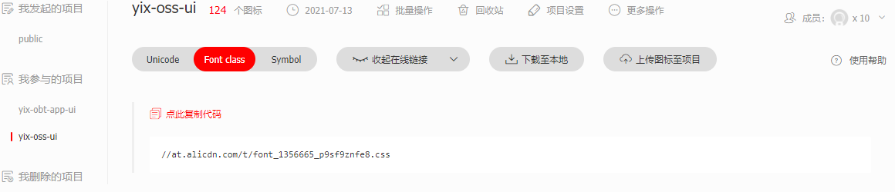

### icon 图标

#### 查找图标

- 图标库地址 https://www.iconfont.cn/ 需申请账号，让管理员加入到当前项目中才可查看/新增

- 在当前项目中找到所需要的图标，点击复制代码（例如：iconshanghu），在页面中使用

  ```html
  <i class="icon iconfont iconshanghu"></i>
  ```

#### 新增图标

- ​	让ui 帮忙上传所需图标
- 复制新生成的链接地址，修改项目中下面两个文件
- 

1. index1.html 中修改 href 地址

   ```html
     <link
         rel="stylesheet"
         type="text/css"
         href="//at.alicdn.com/t/font_1356665_p9sf9znfe8.css"
       />
   ```

2. child-iframe.html中修改 href 地址

