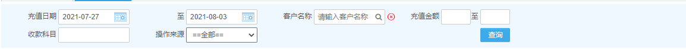
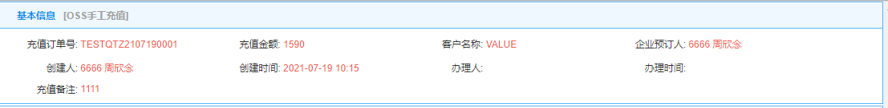

# Layout 布局

#### 常用css样式

```html
<span class="blue pointer ">123123</span>
```

- blue :字体颜色为主体色 蓝色
- red :红色
- black 黑色
- pointer :鼠标移动到该标签后显示为 小手 代表可以点击
- text-center :居中显示
- text-right :居右显示
- text-left :居左显示
- relative :相对定位
- inline-block :改变标签为行内块
- `blueunLin` 蓝色下划线
- `show-ellipsis` 显示省略号

#### 查询条件



```html
      <div class="select-group" style="width: 1160px; min-height: 48px;">
        <div class="in-group">
            <span>充值日期</span>
            <input type="text" class="workinput wicon inpstart" ng-model="model.dateStart " readonly>
            <span>至</span>
            <input type="text" class="workinput wicon inpend" ng-model="model.dateEnd " readonly>
            <span>客户名称</span>
            <p class="inline-block vertical-bottom">
                <ld-input placeholder="请输入客户名称"  value="model.corpName" show-search="true" show-clear="true" search-click="model.corpChange" clear-click="model.corpChange"></ld-input>
            </p>
            <span>充值金额</span>
            <input type="text" style="width: 50px;" ng-model="model.amountStart">至
            <input type="text" style="width: 50px;" ng-model="model.amountEnd">
        </div>
        <div class="in-group">
            <span>收款科目</span>
            <p class="inline-block" style="width: 120px;">
                <input type="text" cancel ng-model="model.paySubjectName" style="width:120px;" />
                <jqselect 
                key-word="model.paySubjectName" 
                use-style="width:433px;"
                    use-template="paySubject"
                    use-length="1|1" 
                    use-ctrl="model.paySubjectCtrl"
                    query="prev" 
                    change-only="true"
                    select-all="true">
                </jqselect>
            </p>
            <span>操作来源</span>
            <select ng-model="model.orderFrom">
                <option value="">==全部==</option>
                <option value="1">OSS预存票款</option>
                <option value="2">OSS手工充值</option>
                <option value="3">EM企业端</option>
                <option value="4">手机APP</option>
            </select>
            <div class="inline-block">
                <button class="btn btn-sm seleBtn" id="search" ng-click="model.search()" style="margin-left: 372px;">查询</button>
            </div>
        </div>
      </div>
```

#### 详情页面




```html
<div class="col">
    <div class="tkDetlhead">
        基本信息
        <span class="tkddly">[{{details.baseInfoBean.operateFrom|operateFrom}}]</span>
    </div>
    <div class="tkDetlbody">
        <!--第一行--> 
        <div class="tkrefundDet">
            <span>充值订单号:</span>
            <label>{{details.baseInfoBean.orderNo}}
            </label>
            <span>充值金额:</span>
            <label>{{details.baseInfoBean.payAmount}}
            </label>
            <span>客户名称:</span>
            <label>{{details.baseInfoBean.corpName}}</label>
            <span>企业预订人:</span>
            <label>{{details.baseInfoBean.applyUserName }}</label>
        </div>
        <!--第二行--> 
        <div class="tkrefundDet">
            <span>充值备注:</span>
            <p style="color: #F05F55;display: inline-block;">{{details.baseInfoBean.bzbz }}</p>
        </div>
    </div>
</div>
```

